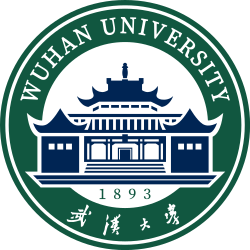

# About Me

Hi! Here is Yixin Huang (黄伊欣). I am a graduate student majoring in communication at Nanjing University, supervised by [Asst Prof. Zhuoxiao Xie](https://www.researchgate.net/profile/Zhuoxiao-Xie).

My interests focus on **platform studies**, **media technologies** and **cross-boder e-commerce**. Feel free to drop me an Email for any form of communication or collaboration!

yixinhuang[at]smail.nju.edu.cn/yixinnn.huang[at]gmail.com

## Education Background

-  **Sep 2024 - Now: Nanjing University**  
  MA, Communication

-  **Sep 2020 - June 2024: Wuhan University**  
  BA, Television Broadcasting Science

## Internship Experiences

-  **Shopee**  
  Ads Platform-Product Manager

-  **Tencent Music**  
  QQ Music-Product Operation

-  **SHEIN**  
  Global Operation Center-Brand Operation

-  **China Youth Daily**  
  Multimedia Center-Journalist

---

